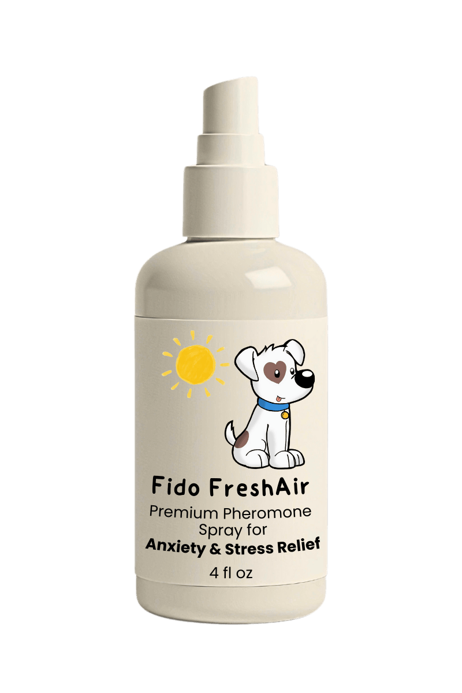

# .aidigestignore

```
dist
node_modules/
.env
package-lock.json
```

# assets/images/certifications/napps.png

This is a binary file of the type: Image

# assets/images/certifications/pet-proven.png

This is a binary file of the type: Image

# assets/images/certifications/safe-pet.png

This is a binary file of the type: Image

# assets/images/product/bottle-main.png

This is a binary file of the type: Image

# assets/images/symptoms/daily-stress.jpg

This is a binary file of the type: Image

# assets/images/symptoms/noise-phobias.jpg

This is a binary file of the type: Image

# assets/images/symptoms/separation-anxiety.jpg

This is a binary file of the type: Image

# assets/images/testimonials/testimonial-1.jpg

This is a binary file of the type: Image

# assets/images/testimonials/testimonial-2.jpg

This is a binary file of the type: Image

# assets/images/trust/guarantee-seal.png

This is a binary file of the type: Image

# assets/images/trust/secure-checkout.png

This is a binary file of the type: Image

# assets/images/trust/stripe.png

This is a binary file of the type: Image

# assets/js/square-checkout.js

```js
// assets/js/square-checkout.js
const products = {
    'starter-package': {
        price: 2999,
        name: '1-Month Starter Package',
        quantity: 1
    },
    'premium-package': {
        price: 6597,
        name: '3-Month Premium Package',
        quantity: 1
    }
};

async function initiateSquarePayment(productId) {
    const appId = 'sq0idp-k3phA5tx6BCvUMGzP2cPQg'; // Replace with your Square app ID
    const locationId = 'LHT54CDG5520W'; // Replace with your Square location ID
    const product = products[productId];

    try {
        // Create Square payments instance
        const payments = window.Square.payments(appId, locationId);

        // Initialize payment request
        const paymentRequest = {
            countryCode: 'US',
            currencyCode: 'USD',
            lineItems: [{
                amount: product.price,
                label: product.name,
                quantity: product.quantity.toString()
            }],
            total: {
                amount: product.price,
                label: 'Total'
            }
        };

        // Initialize Square payment form
        const card = await payments.card();
        
        // Create pre-authorized payment with Square
        const response = await fetch('https://connect.squareupsandbox.com/v2/payments', {
            method: 'POST',
            headers: {
                'Square-Version': '2024-01-17',
                'Authorization': `Bearer ${appId}`,
                'Content-Type': 'application/json'
            },
            body: JSON.stringify({
                source_id: await card.tokenize(),
                amount_money: {
                    amount: product.price,
                    currency: 'USD'
                },
                autocomplete: false, // This makes it a pre-authorization
                idempotency_key: Date.now().toString(),
                note: `Pre-auth for ${product.name}`,
                customer_id: generateCustomerId(), // Optional: If you want to track customers
                reference_id: generateOrderReference(productId) // Your custom order reference
            })
        });

        if (response.ok) {
            // Track authorization events
            trackAuthorization(product);
            
            // Redirect to pending order page
            window.location.href = '/order-pending.html';
        } else {
            throw new Error('Authorization failed');
        }

    } catch (error) {
        console.error('Authorization error:', error);
        alert('Payment authorization failed. Please try again.');
    }
}

// Helper functions
function generateCustomerId() {
    return `CUST_${Date.now()}_${Math.random().toString(36).substr(2, 9)}`;
}

function generateOrderReference(productId) {
    return `ORDER_${productId}_${Date.now()}`;
}

// Analytics tracking functions
function trackAuthorization(product) {
    // Google Analytics
    gtag('event', 'begin_checkout', {
        value: product.price / 100,
        items: [{
            item_name: product.name,
            price: product.price / 100,
            quantity: product.quantity
        }]
    });

    // Facebook Pixel
    fbq('track', 'InitiateCheckout', {
        value: product.price / 100,
        currency: 'USD',
        content_name: product.name,
        content_type: 'product'
    });
}
```

# contact.html

```html
<!DOCTYPE html>
<html lang="en">
<head>
    <meta charset="UTF-8">
    <meta name="viewport" content="width=device-width, initial-scale=1.0">
    <title>Contact Us - Crayford Digital</title>
    <style>
        @import url('https://fonts.googleapis.com/css2?family=Plus+Jakarta+Sans:wght@400;500;600;700&display=swap');
        
        body {
            font-family: 'Plus Jakarta Sans', sans-serif;
            line-height: 1.6;
            color: #2C3E50;
            margin: 0;
            padding: 0;
            background: #F8FAFB;
        }
        
        .container {
            max-width: 800px;
            margin: 0 auto;
            padding: 40px 20px;
        }
        
        h1 {
            color: #27AE60;
            font-size: 2.5rem;
            margin-bottom: 1.5rem;
        }
        
        p {
            margin-bottom: 1rem;
            font-size: 1.1rem;
        }
        
        .contact-email {
            background: white;
            padding: 20px;
            border-radius: 8px;
            box-shadow: 0 2px 4px rgba(0,0,0,0.1);
            margin: 20px 0;
        }
        
        .contact-email a {
            color: #27AE60;
            text-decoration: none;
            font-weight: 500;
        }
        
        .contact-email a:hover {
            text-decoration: underline;
        }
    </style>
</head>
<body>
    <div class="container">
        <h1>Contact Us</h1>
        <p>Thank you for your interest in Crayford Digital. We're here to help with any questions or concerns you may have.</p>
        
        <div class="contact-email">
            <p>Please email us at: <a href="mailto:contact@crayforddigital.com">contact@crayforddigital.com</a></p>
        </div>
        
        <p>Our customer service team typically responds within 24 business hours. We appreciate your patience and look forward to assisting you.</p>
    </div>
</body>
</html>
```

# directory_structure.txt

```txt
.
├── .aidigestignore
├── .env
├── .env.mock
├── assets
│   ├── images
│   │   ├── certifications
│   │   │   ├── napps.png
│   │   │   ├── pet-proven.png
│   │   │   └── safe-pet.png
│   │   ├── product
│   │   │   └── bottle-main.png
│   │   ├── symptoms
│   │   │   ├── daily-stress.jpg
│   │   │   ├── noise-phobias.jpg
│   │   │   └── separation-anxiety.jpg
│   │   ├── testimonials
│   │   │   ├── testimonial-1.jpg
│   │   │   └── testimonial-2.jpg
│   │   └── trust
│   │       ├── guarantee-seal.png
│   │       ├── secure-checkout.png
│   │       └── stripe.png
│   └── js
│       └── square-checkout.js
├── codebase.md
├── contact.html
├── directory_structure.txt
├── index.html
├── package-lock.json
├── package.json
├── privacy.html
├── returns.html
├── server.js
├── shipping.html
├── styles.css
└── success.html

9 directories, 28 files

```

# index.html

```html
<!DOCTYPE html>
<html lang="en">
<head>
    <meta charset="UTF-8">
    <meta name="viewport" content="width=device-width, initial-scale=1.0">
    <title>Fido FreshAir - The #1 Veterinary Solution for Pet Anxiety</title>
    <link href="https://fonts.googleapis.com/css2?family=Plus+Jakarta+Sans:wght@400;500;600;700;800&display=swap" rel="stylesheet">
    <link rel="stylesheet" href="styles.css">
    <script type="text/javascript" src="https://web.squarecdn.com/v1/square.js"></script>
    <script src="/assets/js/square-checkout.js"></script>
</head>
<body>
    <!-- Urgency Bar -->
    <div class="urgency-bar">
        ⚠️ WARNING: Pet Anxiety Can Lead to Serious Health Issues | 🎯 Special:
        Save 45% + FREE Natural Pheromone Kit ($49 Value) | ⏰ Offer Ends:
        <span class="countdown">04:50:19</span>
    </div>

    <!-- Trust Strip -->
    <div class="trust-strip">
        <div class="trust-item">
            <span>🏆</span> Trusted by 15,000+ Caring Pet Parents
        </div>
        <div class="trust-item">
            <span>🐾</span> Featured in: Animal Wellness Magazine
        </div>
        <div class="trust-item">
            <span>⭐</span> "Best Pet Product 2024" - PetCare Excellence
        </div>
    </div>

    <!-- Hero Section -->
    <section class="hero">
        <div class="hero-badge">
            VETERINARY BREAKTHROUGH
        </div>

        <h1>Put an End to Your Pet's Silent Suffering — Bring Lasting Calm with the #1 Vet-Approved Calming Spray</h1>

        <div class="hero-subtitle">
            Imagine your pet, calm and content, no longer plagued by fear. You can make this a reality today.
        </div>

        <div class="stats-grid">
            <div class="stat-item">
                <div class="stat-icon">🔬</div>
                <div class="big-stat">93%</div>
                <div class="stat-description">
                    Success Rate<br>
                    Clinically Proven
                </div>
            </div>

            <div class="stat-item">
                <div class="stat-icon">⚡</div>
                <div class="big-stat">15</div>
                <div class="stat-description">
                    Minutes to Relief<br>
                    Fast-Acting Formula
                </div>
            </div>

            <div class="stat-item">
                <div class="stat-icon">🌿</div>
                <div class="big-stat">100%</div>
                <div class="stat-description">
                    Natural Pheromones<br>
                    Vet Approved
                </div>
            </div>
        </div>

        <div class="cta-box">
            <div class="limited-offer">
                🚨 Just 7 Packages Left — Last Chance to Save 45% and Get Free Priority Shipping! Your Pet's Relief Can't Wait.
            </div>
            
            <a href="#order" class="cta-button">
                Yes! I Want My Pet to Feel Safe & Happy
                <span class="button-subtitle">Click Here to Save 45% Today</span>
            </a>
            
            <div class="save-text">
                Save 45% + Get $49 in FREE Bonuses
            </div>
            
            <div class="security-text">
                🔒 Secure Checkout | 90-Day Money-Back Guarantee
            </div>
        </div>
    </section>

    <!-- Warning Signs Section -->
    <section class="warning-signs">
        <div class="container">
            <h2 class="section-header">Is Your Pet Showing These Signs of Distress? Don't Ignore Their Silent Suffering.</h2>

            <div class="symptoms-grid">
                <div class="symptom-card">
                    
                    <h3>Separation Anxiety</h3>
                    <div class="emotional-trigger">
                        Every time you leave, they think you might never return. Their stress turns to heartbreak.
                    </div>
                    <ul>
                        <li>Destructive behavior when alone</li>
                        <li>Excessive barking/howling</li>
                        <li>Accidents despite being trained</li>
                        <li>Depression & withdrawal</li>
                    </ul>
                </div>

                <div class="symptom-card">
                    
                    <h3>Noise Phobias</h3>
                    <div class="emotional-trigger">
                        Thunder, fireworks, sudden noises — their little heart starts to race with pure terror.
                    </div>
                    <ul>
                        <li>Shaking during storms</li>
                        <li>Panic during fireworks</li>
                        <li>Hiding in dark spaces</li>
                        <li>Excessive panting</li>
                    </ul>
                </div>

                <div class="symptom-card">
                    
                    <h3>Daily Stress</h3>
                    <div class="emotional-trigger">
                        Imagine your pet's world, their instincts filling with confusion and anxiety every single day.
                    </div>
                    <ul>
                        <li>Compulsive behaviors</li>
                        <li>Loss of appetite</li>
                        <li>Sleep problems</li>
                        <li>Aggression</li>
                    </ul>
                </div>
            </div>

            <div class="text-center">
                <p class="emotional-trigger">
                    These may seem like small signs, but they're cries for help. Give your pet the comfort they deserve.
                </p>
                <a href="#order" class="cta-button">
                    Help Your Pet Find Peace Today
                    <span class="button-subtitle">Join 15,000+ Pet Parents Who Found the Solution</span>
                </a>
            </div>
        </div>
    </section>

    <!-- Product Section -->
    <section class="product-showcase">
        <div class="container">
            <div class="section-badge">PREMIUM FORMULA</div>
            <h2 class="section-header">Finally, A Calming Solution That Speaks Your Pet's Language — Naturally and Instantly</h2>
            
            <div class="product-grid">
                <div class="product-image-col">
                    <div class="product-image-wrapper">
                        <div class="product-glow"></div>
                        
                        
                        <div class="product-highlights">
                            <div class="highlight-item">
                                <div class="highlight-icon">🌿</div>
                                <div class="highlight-text">100% Natural</div>
                            </div>
                            <div class="highlight-item">
                                <div class="highlight-icon">⚡</div>
                                <div class="highlight-text">Fast-Acting</div>
                            </div>
                            <div class="highlight-item">
                                <div class="highlight-icon">🏆</div>
                                <div class="highlight-text">Vet Approved</div>
                            </div>
                        </div>
                    </div>
                </div>
                
                <div class="product-details-col">
                    <div class="product-header">
                        <h3>Advanced Pheromone Formula</h3>
                        <p>Our breakthrough calming spray uses patented NeuroCalm Technology to help your pet feel safe and relaxed naturally.</p>
                    </div>
                    
                    <div class="product-features">
                        <div class="feature-item">
                            <div class="feature-icon">🧬</div>
                            <div class="feature-content">
                                <strong>Pheromone Formulated</strong>
                                <span>Matches your pet's natural calming signals</span>
                            </div>
                        </div>
                        
                        <div class="feature-item">
                            <div class="feature-icon">⚡</div>
                            <div class="feature-content">
                                <strong>Rapid Relief</strong>
                                <span>Works in 15 minutes, lasts up to 6 hours</span>
                            </div>
                        </div>
                        
                        <div class="feature-item">
                            <div class="feature-icon">🌿</div>
                            <div class="feature-content">
                                <strong>Premium Ingredients</strong>
                                <span>Chamomile, Lavender & L-Theanine blend</span>
                            </div>
                        </div>
                    </div>
                    
                    <div class="product-usage">
                        <div class="usage-header">
                            <span class="usage-icon">💧</span>
                            <strong>Easy Application</strong>
                        </div>
                        <p>Simply spray in your pet's environment or on bedding, carriers, or clothing. Each 4oz bottle provides approximately 120 applications. Safe and effective for both cats and dogs of all breeds.</p>
                    </div>
                    
                    <a href="#checkout" class="cta-button">
                        Start Your Pet's Journey to Peace
                        <span class="button-subtitle">Save 45% + Claim Your Free Bonuses Now!</span>
                    </a>
                </div>
            </div>
        </div>
    </section>

    <!-- Transformations Section -->
    <section class="transformations">
        <div class="container">
            <h2 class="section-header">See the Life-Changing Impact Fido FreshAir Has Had on Thousands of Pets</h2>
            <p class="section-subtitle">Join over 15,000 pets who went from anxious to peaceful in just minutes</p>

            <div class="testimonial-grid">
                <div class="testimonial-card">
                    <div class="testimonial-image-wrapper">
                        
                    </div>
                    <div class="stars">⭐⭐⭐⭐⭐</div>
                    <p>"My rescue Luna would destroy everything when I left for work. The guilt was unbearable. After just ONE use of Fido FreshAir, she stayed calm and relaxed. The natural pheromones really work! No more destruction, no more anxiety. It's given us both our lives back!"</p>
                    <div class="testimonial-footer">
                        <div class="testimonial-author">- Maria S., Verified Buyer</div>
                        <div class="verification-badge">✓ Purchase Verified | 3-Month Update: "Still Amazing!"</div>
                    </div>
                </div>

                <div class="testimonial-card">
                    <div class="testimonial-image-wrapper">
                        
                    </div>
                    <div class="stars">⭐⭐⭐⭐⭐</div>
                    <p>"Max used to shake uncontrollably during storms. It broke my heart seeing him so terrified. Fido FreshAir transformed him completely - the calming pheromones help him sleep peacefully through even the loudest thunderstorms!"</p>
                    <div class="testimonial-footer">
                        <div class="testimonial-author">- James R., Verified Buyer</div>
                        <div class="verification-badge">✓ Purchase Verified | Posted 2 Weeks Ago</div>
                    </div>
                </div>
            </div>

            <div class="results-summary">
                <div class="big-stat-container">
                    <div class="big-stat">93%</div>
                    <div>Success Rate in Clinical Trials</div>
                </div>
                <div class="big-stat-container">
                    <div class="big-stat">15,000+</div>
                    <div>Happy Pets & Counting</div>
                </div>
                <div class="big-stat-container">
                    <div class="big-stat">4.9/5</div>
                    <div>Average Customer Rating</div>
                </div>
            </div>
        </div>
    </section>

    <!-- Science Section -->
    <section class="science">
        <div class="container">
            <h2 class="section-header">The Science of Lasting Calm™</h2>
            <p class="section-subtitle">Advanced pheromone formula backed by 3 years of research and clinical studies</p>

            <div class="science-grid">
                <div class="science-card">
                    <div class="science-icon">🧬</div>
                    <h3>Patented Calming Complex</h3>
                    <p>Our revolutionary NeuroCalmTM pheromone technology works in harmony with your pet's brain chemistry, utilizing advanced neuroscience to create a state of natural relaxation without sedation.</p>
                    <ul>
                        <li>Reduces stress hormones naturally</li>
                        <li>Promotes relaxation signals</li>
                        <li>Maintains healthy brain function</li>
                        <li>Supports emotional balance</li>
                    </ul>
                </div>

                <div class="science-card">
                    <div class="science-icon">🌿</div>
                    <h3>Premium Natural Ingredients</h3>
                    <p>Each ingredient is carefully selected and scientifically validated for its calming properties, creating a powerful synergy that delivers remarkable results without side effects.</p>
                    <ul>
                        <li>Organic Chamomile - Promotes relaxation</li>
                        <li>Pure Lavender Extract - Calms nerves</li>
                        <li>L-Theanine - Reduces stress</li>
                        <li>Natural Pheromones - Creates comfort</li>
                    </ul>
                </div>

                <div class="science-card">
                    <div class="science-icon">⚡</div>
                    <h3>Rapid Absorption Formula</h3>
                    <p>Our innovative delivery system ensures maximum bioavailability, allowing the active ingredients to reach your pet's system quickly and effectively.</p>
                    <ul>
                        <li>Relief within 15 minutes</li>
                        <li>Long-lasting calm (6-8 hours)</li>
                        <li>No drowsiness or side effects</li>
                        <li>Safe for daily use</li>
                    </ul>
                </div>
            </div>

            <div class="results-grid">
                <div class="big-stat-container">
                    <div class="big-stat">93%</div>
                    <div>Reduction in anxiety behaviors</div>
                </div>
                <div class="big-stat-container">
                    <div class="big-stat">89%</div>
                    <div>Improvement in sleep quality</div>
                </div>
                <div class="big-stat-container">
                    <div class="big-stat">95%</div>
                    <div>Would recommend to others</div>
                </div>
            </div>
        </div>
    </section>

    <!-- Pricing Section -->
    <section id="order" class="section pricing">
        <div class="container">
            <h2 class="section-header">Choose Your Savings Package</h2>
            <p>Every Order Includes Our "Peace of Mind" Guarantee</p>
    
            <div class="pricing-grid">
                <div class="pricing-card best-value">
                    <div class="best-value-badge">
                        MOST POPULAR
                    </div>
    
                    <h3>3-Month Premium Package</h3>
    
                    <div class="price">
                        <span class="original-price">$119.97</span>
                        <span class="sale-price">$65.97</span>
                        <span class="savings">Best Value — Save $54 Instantly!</span>
                    </div>
    
                    <div class="value-label">
                        Most Popular Choice for Long-Term Relief
                    </div>
    
                    <ul class="benefits-list">
                        <li>3 Premium Bottles of Fido FreshAir™ ($119.97 Value)</li>
                        <li>FREE Anxiety Prevention Kit ($29 Value)</li>
                        <li>FREE Priority Shipping ($9.95 Value)</li>
                        <li>FREE Training Guide ($19 Value)</li>
                        <li>Extended 90-Day Guarantee</li>
                        <li class="highlight">SAVE $54 TODAY!</li>
                    </ul>
    
                    <button onclick="initiateSquarePayment('premium-package')" class="cta-button">
                        Get The 3-Month Package Now
                        <span class="button-subtitle">
                            Total Value: $177.92 🎁 You Pay: $65.97
                        </span>
                    </button>
    
                    <div class="stock-warning">
                        Only 7 Discount Packages Remaining
                    </div>
                </div>
    
                <div class="pricing-card">
                    <h3>1-Month Starter Package</h3>
    
                    <div class="price">
                        <span class="original-price">$39.99</span>
                        <span class="sale-price">$29.99</span>
                        <span class="savings">Perfect for First-Time Buyers</span>
                    </div>
    
                    <ul class="benefits-list">
                        <li>1 Premium Bottle of Fido FreshAir™</li>
                        <li>FREE Anxiety Prevention Kit ($29 Value)</li>
                        <li>Standard Shipping ($4.95)</li>
                        <li>30-Day Guarantee</li>
                    </ul>
    
                    <button onclick="initiateSquarePayment('starter-package')" class="cta-button">
                        Get The 1-Month Package
                        <span class="button-subtitle">
                            Try 1 Bottle + Free Bonus for $29.99 — Save 25% Instantly!
                        </span>
                    </button>
                </div>
            </div>
        </div>
    </section>

    <!-- FAQ Section -->
    <section class="faq">
        <div class="container">
            <h2 class="section-header">Common Questions from Caring Pet Parents</h2>
            
            <div class="faq-grid">
                <div class="faq-card">
                    <h3>How quickly will I see results?</h3>
                    <p>Most pet parents see a noticeable improvement in their pet's behavior within 15-30 minutes. Our patented pheromone technology works quickly to help your pet feel more relaxed and at ease.</p>
                    <div class="testimonial-quote">
                        "Within minutes, my anxious rescue went from panting and pacing to lying calmly on her bed. Finally a good night's sleep."<br>
                        — <strong>Jennifer K. (Scottsdale, AZ)</strong>
                    </div>
                </div>
    
                <div class="faq-card">
                    <h3>How do I use Fido FreshAir™?</h3>
                    <p>Using Fido FreshAir™ is incredibly simple:</p>
                    <ul>
                        <li>For immediate relief: Spray 2-3 times in your pet's environment or on their favorite resting spots</li>
                        <li>For preventive calm: Spray on bedding, carriers, or clothing 15 minutes before stressful situations</li>
                        <li>For daily use: Apply 2-3 sprays in the morning or before leaving home</li>
                    </ul>
                    <p>Each spray delivers a precise dose of our calming formula. Never spray directly on your pet - just their environment. The natural pheromones will do the rest!</p>
                    <div class="testimonial-quote">
                        "So easy to use! I just spray it on her bed each morning and before thunderstorms. It's become part of our routine and she's so much calmer."<br>
                        — <strong>Emma R. (Boulder, CO)</strong>
                    </div>
                </div>
    
                <div class="faq-card">
                    <h3>Is Fido FreshAir™ safe for my pet?</h3>
                    <p>Absolutely! Fido FreshAir™ is veterinarian-formulated and completely safe for both cats and dogs. Our natural formula is:</p>
                    <ul>
                        <li>Non-sedating & Non-addictive</li>
                        <li>Made with premium natural ingredients</li>
                        <li>Extensively tested and approved</li>
                        <li>Safe for daily use</li>
                    </ul>
                    <div class="testimonial-quote">
                        "I recommend Fido FreshAir with complete confidence to all my patients."<br>
                        — <strong>Dr. Wilson, DVM (San Francisco, CA)</strong>
                    </div>
                </div>

                <div class="faq-card">
                    <h3>Is this safe for all breeds of dogs? What about cats?</h3>
                    <p>Absolutely! Fido FreshAir™ is specially formulated to be safe and effective for all breeds of dogs and cats, from tiny Chihuahuas to large Great Danes, and all feline friends. Our natural pheromone blend mimics the calming signals that all dogs and cats naturally respond to, regardless of breed, size, or age.</p>
                    <div class="testimonial-quote">
                        "I have both a Maine Coon cat and a German Shepherd. This works beautifully for both of them during thunderstorms!"<br>
                        — <strong>Rachel M. (Minneapolis, MN)</strong>
                    </div>
                </div>
    
                <div class="faq-card">
                    <h3>What if it doesn't work for my pet?</h3>
                    <p>While Fido FreshAir™ has a 93% success rate, we understand every pet is unique. That's why every order is protected by our 90-Day Money-Back Guarantee. If you're not amazed by the results, simply return the bottles (even if empty) for a full refund.</p>
                    <div class="testimonial-quote">
                        "I was skeptical, but the guarantee made it easy to try. Now I'm a believer!"<br>
                        — <strong>Michael R. (Austin, TX)</strong>
                    </div>
                </div>
    
                <div class="faq-card">
                    <h3>How long does one bottle last?</h3>
                    <p>Each 4oz bottle contains approximately 120 sprays - enough for 30-45 days of regular use. Our 3-month supply ensures you never run out while saving 45%!</p>
                    <div class="testimonial-quote">
                        "Definitely get more than you need, because you'll definitely end up needing it."<br>
                        — <strong>Sarah M. (Boston, MA)</strong>
                    </div>
                </div>
    
                <div class="faq-card">
                    <h3>How quickly can I get my order?</h3>
                    <p>We ship all orders within 24 hours using premium carriers. Most customers receive their order in 2-4 business days. Plus, all 3-month packages include FREE priority shipping to get your pet relief even faster. Orders over $65 automatically qualify for free shipping!</p>
                    <div class="testimonial-quote">
                        "Ordered Sunday night, arrived Wednesday morning. Easy enough!"<br>
                        — <strong>Jennifer T. (Seattle, WA)</strong>
                    </div>
                </div>
    
                <div class="faq-card">
                    <h3>Can I use this alongside other calming products?</h3>
                    <p>Yes! Fido FreshAir™ is 100% natural and safe to use with other pet wellness products. Many veterinarians actually recommend it as a complementary solution alongside behavior training or other calming aids. There are no known interactions with medications or supplements.</p>
                    <div class="testimonial-quote">
                        "I was glad to learn I could use this with Max's other supplements. The combination has been life-changing for us."<br>
                        — <strong>Robert P. (Nashville, TN)</strong>
                    </div>
                </div>
    
                <div class="faq-card">
                    <h3>What if I'm not sure about my pet's anxiety level?</h3>
                    <p>If your pet shows any signs of stress - including excessive barking, destructive behavior, or restlessness - they could benefit from Fido FreshAir™. Our formula is gentle enough for daily use but effective enough for severe anxiety. With our 90-day guarantee, you can try it risk-free to see how it helps your pet's specific needs.</p>
                    <div class="testimonial-quote">
                        "I wasn't sure if my cat needed it, but the difference in her demeanor is absolutely amazing."<br>
                        — <strong>Michelle K. (Denver, CO)</strong>
                    </div>
                </div>
    
                <div class="faq-card">
                    <h3>Will the spray stain furniture or clothing?</h3>
                    <p>No! Our clear formula is completely stain-free and leaves no residue on furniture, bedding, or clothing. It dries quickly and is completely undetectable except for its calming effects on your pet. You can spray it confidently on any surface in your home.</p>
                    <div class="testimonial-quote">
                        "I use it on my expensive couch where my dog likes to rest, and I've never seen a stain."<br>
                        — <strong>David L. (Greenwich, CT)</strong>
                    </div>
                </div>
            </div>
        </div>
    </section>

    <!-- Guarantee Section -->
    <section class="guarantee">
        <div class="container">
            <div class="guarantee-box">
                
                
                <div class="guarantee-content">
                    <h3>Try Fido FreshAir™ Risk-Free — 100% Money-Back Guarantee</h3>
                    <p>If Fido FreshAir™ doesn't give your pet the relief they deserve within 30 days, we'll give you a full refund. No questions, no hassle. That's our promise to you and your pet.</p>
                    
                    <div class="guarantee-features">
                        <div class="guarantee-feature">
                            <span class="check-icon">✓</span> No Questions Asked
                        </div>
                        
                        <div class="guarantee-feature">
                            <span class="check-icon">✓</span> Easy Returns
                        </div>
                        
                        <div class="guarantee-feature">
                            <span class="check-icon">✓</span> 100% Money Back
                        </div>
                    </div>
                </div>
            </div>
        </div>
    </section>

    <!-- Final CTA Section -->
    <section class="final-cta">
        <div class="container">
            <h2 class="section-header">Give Your Pet the Gift of Peace Today</h2>
            
            <div class="final-offer-box">
                <div class="offer-text">
                    🔥 Flash Sale: Save 45% + Get $49 in FREE Bonuses<br>
                    <span class="stock-warning">Only 7 Discount Packages Remaining</span>
                </div>
                
                <a href="#checkout" class="cta-button">
                    Give Your Pet the Gift of Peace Today
                    <span class="button-subtitle">Free Priority Shipping | 90-Day Guarantee</span>
                </a>
                
                <div class="trust-features">
                    <div class="trust-feature">
                        
                        <div>
                            <strong>🔒 Secure Checkout</strong>
                            <div>256-bit SSL Encryption</div>
                        </div>
                    </div>
                    
                    <div class="trust-feature">
                        
                        <div>
                            <strong>💳 Flexible Payment</strong>
                            <div>All Major Cards Accepted</div>
                        </div>
                    </div>
                </div>
            </div>
        </div>
    </section>

    <!-- Footer -->
    <footer class="site-footer">
        <div class="container">
            <div class="footer-grid">
                <div class="footer-column">
                    <h4>Customer Care</h4>
                    <ul>
                        <li><a href="contact.html">Contact Us</a></li>
                        <li><a href="shipping.html">Shipping Information</a></li>
                        <li><a href="returns.html">Return Policy</a></li>
                        <li><a href="privacy.html">Privacy Policy</a></li>
                    </ul>
                </div>

                <div class="footer-column">
                    <h4>Our Guarantee</h4>
                    <div class="footer-guarantee">
                        
                        <div>100% Satisfaction Guaranteed or Your Money Back</div>
                    </div>
                </div>

                <div class="footer-column">
                    <h4>Certified By</h4>
                    <div class="certifications">
                        
                        
                        
                    </div>
                </div>
            </div>

            <div class="footer-bottom">
                
                <div class="copyright">© 2024 Fido FreshAir™. All Rights Reserved.</div>
            </div>
        </div>
    </footer>

    <script>
        // Countdown Timer
        function updateCountdown() {
            const now = new Date();
            const end = new Date();
            end.setHours(23, 59, 59);
            
            const diff = end - now;
            const hours = Math.floor(diff / (1000 * 60 * 60));
            const minutes = Math.floor((diff % (1000 * 60 * 60)) / (1000 * 60));
            const seconds = Math.floor((diff % (1000 * 60)) / 1000);
            
            document.querySelector('.countdown').textContent = 
                `${hours.toString().padStart(2, '0')}:${minutes.toString().padStart(2, '0')}:${seconds.toString().padStart(2, '0')}`;
        }
        
        setInterval(updateCountdown, 1000);
        updateCountdown();
    </script>
    <script type="text/javascript" src="https://web.squarecdn.com/v1/square.js"></script>
    <script src="/assets/js/square-checkout.js"></script>
    <script>
        console.log('Scripts loaded');
        document.addEventListener('DOMContentLoaded', () => {
            console.log('DOM fully loaded');
            console.log('CTA buttons found:', document.querySelectorAll('.cta-button').length);
        });
    </script>
</body>
</html>
```

# order-status.html

```html
<!DOCTYPE html>
<html lang="en">
<head>
    <meta charset="UTF-8">
    <meta name="viewport" content="width=device-width, initial-scale=1.0">
    <title>Order Status - Thank You! - Fido FreshAir</title>
    <link rel="stylesheet" href="styles.css">
</head>
<body>
    <div class="container" style="text-align: center; padding: 100px 20px;">
        <h1>Thank You for Your Order!</h1>
        <p>Your order is being processed and will be confirmed shortly.</p>
        <p>You will receive a confirmation email once your order has been verified.</p>
        <p class="order-id" style="font-size: 14px; color: #666; margin-top: 20px;">
            Order Reference: <span id="displayOrderId"></span>
        </p>
        <a href="/" class="cta-button" style="display: inline-block; margin-top: 20px;">
            Return to Homepage
        </a>
    </div>

    <script>
        const orderIdSpan = document.getElementById('displayOrderId');
        const orderId = new URLSearchParams(window.location.search).get('reference');
        if (orderIdSpan && orderId) {
            orderIdSpan.textContent = orderId;
        }
    </script>
</body>
</html>
```

# privacy.html

```html
<!DOCTYPE html>
<html lang="en">
<head>
    <meta charset="UTF-8">
    <meta name="viewport" content="width=device-width, initial-scale=1.0">
    <title>Privacy Policy - Crayford Digital</title>
    <style>
        @import url('https://fonts.googleapis.com/css2?family=Plus+Jakarta+Sans:wght@400;500;600;700&display=swap');
        
        body {
            font-family: 'Plus Jakarta Sans', sans-serif;
            line-height: 1.6;
            color: #2C3E50;
            margin: 0;
            padding: 0;
            background: #F8FAFB;
        }
        
        .container {
            max-width: 800px;
            margin: 0 auto;
            padding: 40px 20px;
        }
        
        h1, h2 {
            color: #27AE60;
        }
        
        h1 {
            font-size: 2.5rem;
            margin-bottom: 1.5rem;
        }
        
        h2 {
            font-size: 1.5rem;
            margin: 2rem 0 1rem;
        }
        
        p {
            margin-bottom: 1rem;
            font-size: 1.1rem;
        }
        
        .policy-section {
            background: white;
            padding: 20px;
            border-radius: 8px;
            box-shadow: 0 2px 4px rgba(0,0,0,0.1);
            margin: 20px 0;
        }
        
        ul {
            margin-bottom: 1rem;
            padding-left: 20px;
        }
        
        li {
            margin-bottom: 0.5rem;
        }
    </style>
</head>
<body>
    <div class="container">
        <h1>Privacy Policy</h1>
        
        <div class="policy-section">
            <h2>Information We Collect</h2>
            <p>Crayford Digital LLC collects information that you provide directly to us, including:</p>
            <ul>
                <li>Name and contact information</li>
                <li>Billing and shipping information</li>
                <li>Order history and preferences</li>
                <li>Communications with our customer service team</li>
            </ul>
            
            <h2>How We Use Your Information</h2>
            <p>We use the information we collect to:</p>
            <ul>
                <li>Process your orders and payments</li>
                <li>Communicate with you about your orders</li>
                <li>Send marketing communications (with your consent)</li>
                <li>Improve our products and services</li>
            </ul>
            
            <h2>Information Sharing</h2>
            <p>We do not sell or rent your personal information to third parties. We may share your information with:</p>
            <ul>
                <li>Service providers who assist in our operations</li>
                <li>Professional advisers and legal authorities when required by law</li>
            </ul>
            
            <h2>Data Security</h2>
            <p>We implement appropriate security measures to protect your personal information. However, no method of transmission over the Internet is 100% secure.</p>
            
            <h2>Your Rights</h2>
            <p>You have the right to:</p>
            <ul>
                <li>Access your personal information</li>
                <li>Correct inaccurate information</li>
                <li>Request deletion of your information</li>
                <li>Opt-out of marketing communications</li>
            </ul>
            
            <h2>Updates to This Policy</h2>
            <p>We may update this privacy policy from time to time. The updated version will be indicated by an updated "Last revised" date.</p>
        </div>
        
        <p>For privacy-related questions, please contact us at <a href="mailto:contact@crayforddigital.com">contact@crayforddigital.com</a></p>
    </div>
</body>
</html>
```

# returns.html

```html
<!DOCTYPE html>
<html lang="en">
<head>
    <meta charset="UTF-8">
    <meta name="viewport" content="width=device-width, initial-scale=1.0">
    <title>Return Policy - Crayford Digital</title>
    <style>
        @import url('https://fonts.googleapis.com/css2?family=Plus+Jakarta+Sans:wght@400;500;600;700&display=swap');
        
        body {
            font-family: 'Plus Jakarta Sans', sans-serif;
            line-height: 1.6;
            color: #2C3E50;
            margin: 0;
            padding: 0;
            background: #F8FAFB;
        }
        
        .container {
            max-width: 800px;
            margin: 0 auto;
            padding: 40px 20px;
        }
        
        h1, h2 {
            color: #27AE60;
        }
        
        h1 {
            font-size: 2.5rem;
            margin-bottom: 1.5rem;
        }
        
        h2 {
            font-size: 1.5rem;
            margin: 2rem 0 1rem;
        }
        
        p {
            margin-bottom: 1rem;
            font-size: 1.1rem;
        }
        
        .policy-section {
            background: white;
            padding: 20px;
            border-radius: 8px;
            box-shadow: 0 2px 4px rgba(0,0,0,0.1);
            margin: 20px 0;
        }
        
        ul {
            margin-bottom: 1rem;
            padding-left: 20px;
        }
        
        li {
            margin-bottom: 0.5rem;
        }
    </style>
</head>
<body>
    <div class="container">
        <h1>Return Policy</h1>
        
        <div class="policy-section">
            <h2>90-Day Money-Back Guarantee</h2>
            <p>At Crayford Digital LLC, we stand behind our products with a 90-day money-back guarantee. If you're not completely satisfied with your purchase, we'll gladly refund your money.</p>
            
            <h2>Return Process</h2>
            <ul>
                <li>Contact us within 90 days of receiving your product</li>
                <li>Email contact@crayforddigital.com to initiate your return</li>
                <li>Include your order number and reason for return</li>
                <li>We'll provide return shipping instructions</li>
            </ul>
            
            <h2>Refund Information</h2>
            <p>Refunds will be processed within 5-7 business days after we receive your return. The refund will be issued to your original payment method.</p>
            
            <h2>Return Conditions</h2>
            <ul>
                <li>Products must be in their original packaging</li>
                <li>Digital products and downloadable items are non-refundable</li>
                <li>Shipping costs are non-refundable unless the product was defective</li>
            </ul>
        </div>
        
        <p>For specific questions about returns, please contact our customer service team at <a href="mailto:contact@crayforddigital.com">contact@crayforddigital.com</a></p>
    </div>
</body>
</html>
```

# shipping.html

```html
<!DOCTYPE html>
<html lang="en">
<head>
    <meta charset="UTF-8">
    <meta name="viewport" content="width=device-width, initial-scale=1.0">
    <title>Shipping Information - Crayford Digital</title>
    <style>
        @import url('https://fonts.googleapis.com/css2?family=Plus+Jakarta+Sans:wght@400;500;600;700&display=swap');
        
        body {
            font-family: 'Plus Jakarta Sans', sans-serif;
            line-height: 1.6;
            color: #2C3E50;
            margin: 0;
            padding: 0;
            background: #F8FAFB;
        }
        
        .container {
            max-width: 800px;
            margin: 0 auto;
            padding: 40px 20px;
        }
        
        h1, h2 {
            color: #27AE60;
        }
        
        h1 {
            font-size: 2.5rem;
            margin-bottom: 1.5rem;
        }
        
        h2 {
            font-size: 1.5rem;
            margin: 2rem 0 1rem;
        }
        
        p {
            margin-bottom: 1rem;
            font-size: 1.1rem;
        }
        
        .shipping-info {
            background: white;
            padding: 20px;
            border-radius: 8px;
            box-shadow: 0 2px 4px rgba(0,0,0,0.1);
            margin: 20px 0;
        }
    </style>
</head>
<body>
    <div class="container">
        <h1>Shipping Information</h1>
        
        <div class="shipping-info">
            <h2>Processing Time</h2>
            <p>Orders are typically processed within 1-2 business days.</p>
            
            <h2>Shipping Methods</h2>
            <p>We offer standard shipping (5-7 business days) and expedited shipping (2-3 business days).</p>
            
            <h2>Shipping Costs</h2>
            <p>Standard shipping is free for orders over $50. Expedited shipping costs will be calculated at checkout.</p>
            
            <h2>International Shipping</h2>
            <p>We currently ship only within the United States and Canada.</p>
            
            <h2>Tracking Information</h2>
            <p>Once your order ships, you will receive a tracking number via email.</p>
        </div>
        
        <p>For specific shipping questions, please contact our customer service team at <a href="mailto:contact@crayforddigital.com">contact@crayforddigital.com</a></p>
    </div>
</body>
</html>
```

# styles.css

```css
/* Typography and Base Styles */
@import url('https://fonts.googleapis.com/css2?family=Plus+Jakarta+Sans:wght@400;500;600;700;800&display=swap');

:root {
    /* Colors */
    --primary: #27AE60;
    --primary-light: #2ECC71;
    --primary-dark: #219653;
    --secondary: #F4F9F9;
    --accent: #E7C697;
    --danger: #FF6B6B;
    --success: #27AE60;
    --text: #2C3E50;
    --text-light: #718096;
    
    /* Shadows */
    --shadow-sm: 0 2px 4px rgba(0,0,0,0.05);
    --shadow-md: 0 4px 6px rgba(0,0,0,0.1);
    --shadow-lg: 0 10px 15px rgba(0,0,0,0.1);
    
    /* Border Radius */
    --radius-sm: 4px;
    --radius-md: 8px;
    --radius-lg: 12px;
}

* {
    margin: 0;
    padding: 0;
    box-sizing: border-box;
}

body {
    font-family: 'Plus Jakarta Sans', -apple-system, BlinkMacSystemFont, sans-serif;
    line-height: 1.6;
    color: var(--text);
    background: #F8FAFB;
    -webkit-font-smoothing: antialiased;
}

.container {
    max-width: 1000px; /* Consistent width across sections */
    margin: 0 auto;
    padding: 0 24px;
}

.cta-button {
    font-size: 24px;
    padding: 24px 48px;
}

/* Typography */
h1, h2, h3, h4, h5, h6 {
    font-weight: 700;
    line-height: 1.2;
    color: var(--text);
}

.section-header {
    font-size: 3.5rem;
    text-align: center;
    margin: 4rem auto 2rem;
    font-weight: 800;
    color: var(--primary);
    letter-spacing: -0.02em;
    max-width: 1200px;
    padding: 0 20px;
    line-height: 1.2;
    word-spacing: -2px; /* Add slight negative word spacing */
    white-space: nowrap; /* Keep on one line */
}


@media (max-width: 1200px) {
    .section-header {
        white-space: normal;
        font-size: 2.8rem; /* Slightly reduce font size */
    }
}

@media (max-width: 768px) {
    .section-header {
        font-size: 2.5rem;
        margin: 3rem auto 1.5rem;
    }
}

.section-header,
.section-subtitle {
    white-space: normal;
    overflow: visible;
    text-overflow: clip;
}

.section-header span,
.section-subtitle span {
    word-spacing: -2px;
}

@media (max-width: 768px) {
    .section-header {
        /* Break at specific points using word breaks */
        display: inline-block;
    }
    
    .section-header[data-break="transformations"] {
        display: block;
    }
    .section-header[data-break="transformations"]::after {
        content: "\A";
        white-space: pre;
    }
}

.section-subtitle {
    text-align: center;
    font-size: 20px;
    color: var(--text-light);
    margin-bottom: 48px;
    margin-left: auto;
    margin-right: auto;
    white-space: nowrap;
    max-width: 100%;
}

@media (max-width: 768px) {
    .section-header,
    .section-subtitle {
        white-space: normal;
    }
}

/* Animations */
@keyframes shine {
    0% { transform: translateX(-100%) rotate(45deg); }
    100% { transform: translateX(100%) rotate(45deg); }
}

@keyframes float {
    0%, 100% { transform: translateY(0); }
    50% { transform: translateY(-8px); }
}

/* Top Bar and Trust Strip */
.urgency-bar {
    background: linear-gradient(90deg, var(--danger), #FF8E53);
    color: white;
    text-align: center;
    padding: 14px 24px;
    font-weight: 500;
    font-size: 15px;
}

.trust-strip {
    background: white;
    padding: 20px 24px;
    display: flex;
    justify-content: center;
    gap: 64px;
    box-shadow: var(--shadow-sm);
}

.trust-item {
    font-size: 16px;
    font-weight: 500;
    display: flex;
    align-items: center;
    gap: 12px;
}

.trust-item span {
    font-size: 28px;
}

/* Hero Section */
.hero {
    max-width: 1200px;
    margin: 0 auto;
    padding: 80px 24px;
    text-align: center;
}

.hero-badge {
    display: inline-block;
    background: var(--primary);
    color: white;
    padding: 8px 20px;
    font-size: 14px;
    font-weight: 600;
    text-transform: uppercase;
    margin-bottom: 40px;
    border-radius: 6px;
    letter-spacing: 1px;
}

.hero h1 {
    font-size: 56px;
    line-height: 1.2;
    margin-bottom: 24px;
    font-weight: 800;
    letter-spacing: -0.02em;
}

.hero-subtitle {
    color: var(--danger);
    font-size: 24px;
    margin-bottom: 48px;
    font-weight: 500;
}

/* Hero Stats */
.stats-grid {
    display: grid;
    grid-template-columns: repeat(3, 1fr);
    gap: 40px;
    max-width: 1000px;
    margin: 0 auto 64px;
}

.stat-item {
    background: white;
    padding: 32px;
    border-radius: var(--radius-md);
    box-shadow: var(--shadow-md);
    transition: transform 0.3s ease;
    text-align: center;
}

.stat-icon {
    font-size: 48px;
    margin-bottom: 24px;
    text-align: center;
    display: block;
}

.big-stat {
    font-size: 4.5rem;
    font-weight: 800;
    line-height: 1;
    color: var(--success);
    margin-bottom: 0.5rem;
}

.stat-description {
    color: var(--text-light);
    font-size: 16px;
}

/* CTA Sections */
.cta-box {
    background: white;
    padding: 48px;
    border-radius: var(--radius-lg);
    box-shadow: var(--shadow-lg);
    max-width: 1000px;
    margin: 0 auto;
    text-align: center;
}

.limited-offer {
    color: var(--danger);
    font-size: 16px;
    font-weight: 600;
    padding: 12px 20px;
    border-radius: var(--radius-sm);
    margin-bottom: 24px;
    display: inline-block;
    background: rgba(255, 107, 107, 0.1);
    border: 1px solid rgba(255, 107, 107, 0.2);
}

.cta-button {
    display: block;
    background: var(--primary);
    color: white;
    text-decoration: none;
    padding: 24px 48px;
    border-radius: var(--radius-md);
    font-size: 24px;
    font-weight: 700;
    margin-bottom: 16px;
    transition: all 0.3s ease;
    position: relative;
    overflow: hidden;
    text-align: center;
}

.cta-button::after {
    content: '';
    position: absolute;
    top: -50%;
    left: -50%;
    width: 200%;
    height: 200%;
    background: linear-gradient(45deg, transparent, rgba(255,255,255,0.1), transparent);
    transform: rotate(45deg);
    animation: shine 3s infinite;
}

.text-center {
    text-align: center;
    max-width: 600px;
    margin: 0 auto;
}

.cta-button:hover {
    transform: translateY(-2px);
    background: var(--primary-light);
    box-shadow: var(--shadow-lg);
}

.button-subtitle {
    display: block;
    font-size: 16px;
    margin-top: 8px;
    opacity: 0.9;
    font-weight: normal;
    text-align: center;
}

.save-text {
    font-size: 16px;
    color: var(--success);
    margin-bottom: 16px;
    font-weight: 500;
}

.security-text {
    font-size: 14px;
    color: var(--text-light);
    display: flex;
    align-items: center;
    justify-content: center;
    gap: 8px;
}

/* Warning Signs Section */
.warning-signs {
    padding: 80px 0;
}

.symptoms-grid {
    max-width: 1000px;
    margin: 48px auto;
    display: grid;
    grid-template-columns: repeat(3, 1fr);
    gap: 40px;
}

.symptom-card {
    display: flex;
    flex-direction: column;
    height: 100%;
    padding: 40px 32px;
    background: white;
    border-radius: var(--radius-md);
    box-shadow: var(--shadow-md);
}

.symptom-card img {
    width: 200px;
    height: 200px;
    border-radius: 50%;
    margin: 0 auto 32px;
    object-fit: cover;
}

.symptom-card h3 {
    font-size: 24px;
    margin-bottom: 16px;
    color: var(--primary);
    text-align: center;
    min-height: 36px; /* Ensure consistent height for titles */
}


.emotional-trigger {
    color: #FF6B6B;
    text-align: center;
    font-size: 18px;
    margin-bottom: 40px; /* Fixed spacing before bullet points */
    min-height: 80px; /* Ensure consistent height for emotional triggers */
    display: flex;
    align-items: center;
    justify-content: center;
}


p, .symptom-card li, .science-card p, .faq-card p, 
.testimonial-text, .benefits-list li {
    font-size: 17px;
    line-height: 1.6;
}

.symptom-card ul {
    list-style: none;
    padding: 0;
    margin: 0;
}

.symptom-card li {
    padding-left: 24px;
    position: relative;
    margin-bottom: 12px;
}

.symptom-card li:before {
    content: "✓";
    color: var(--success);
    position: absolute;
    left: 0;
}

/* Add this to your existing CSS file */
.product-showcase {
    padding: 100px 0;
    background: linear-gradient(180deg, var(--secondary) 0%, #fff 100%);
    position: relative;
    overflow: hidden;
}

.section-badge {
    background: var(--primary);
    color: white;
    font-size: 14px;
    font-weight: 600;
    padding: 8px 20px;
    border-radius: 100px;
    display: inline-block;
    margin: 0 auto 32px;
    letter-spacing: 1px;
    transform: translateX(-50%);
    left: 50%;
    position: relative;
}

.product-grid {
    display: grid;
    grid-template-columns: 0.9fr 1.1fr;
    gap: 80px;
    margin-top: 64px;
    align-items: end;  /* Change from center to end for bottom alignment */
    position: relative;
}


.product-image-wrapper {
    background: white;
    padding: 80px 60px;  /* Increased padding to give more white space around larger image */
    border-radius: 30px;
    box-shadow: 0 25px 50px -12px rgba(0, 0, 0, 0.1);
    position: relative;
    overflow: hidden;
    transition: transform 0.3s ease;
}

.product-image-wrapper:hover {
    transform: translateY(-5px);
}

.product-glow {
    position: absolute;
    top: -50%;
    left: -50%;
    width: 200%;
    height: 200%;
    background: radial-gradient(circle at center, rgba(39, 174, 96, 0.1) 0%, transparent 70%);
    pointer-events: none;
    animation: rotate 20s linear infinite;
}

@keyframes rotate {
    from { transform: rotate(0deg); }
    to { transform: rotate(360deg); }
}

.product-image {
    width: 100%;
    height: auto;
    max-width: 400px;  /* Increased from 300px */
    display: block;
    margin: 0 auto;
    position: relative;
    z-index: 2;
}

.product-highlights {
    display: flex;
    justify-content: center;
    gap: 24px;
    margin-top: 40px;
}

.highlight-item {
    text-align: center;
}

.highlight-icon {
    font-size: 24px;
    background: var(--secondary);
    width: 56px;
    height: 56px;
    border-radius: 16px;
    display: flex;
    align-items: center;
    justify-content: center;
    margin: 0 auto 12px;
    transition: transform 0.3s ease;
}

.highlight-item:hover .highlight-icon {
    transform: scale(1.1);
}

.highlight-text {
    font-size: 14px;
    font-weight: 600;
    color: var(--text);
}

.product-header {
    margin-bottom: 48px;
}

.product-header h3 {
    font-size: 36px;
    font-weight: 800;
    color: var(--primary);
    margin-bottom: 16px;
    line-height: 1.2;
}

.product-header p {
    font-size: 18px;
    line-height: 1.6;
    color: var(--text);
    max-width: 90%;
}

.product-features {
    display: flex;
    flex-direction: column;
    gap: 32px;
    margin-bottom: 40px;
}

.feature-item {
    display: flex;
    gap: 20px;
    align-items: center;
}

.feature-icon {
    background: rgba(39, 174, 96, 0.15);  /* Lighter green background */
    width: 56px;
    height: 56px;
    border-radius: 16px;
    display: flex;
    align-items: center;
    justify-content: center;
    font-size: 24px;
    color: var(--primary-dark);  /* Darker green for contrast */
    flex-shrink: 0;
    transition: transform 0.3s ease;
}

.feature-item:hover .feature-icon {
    transform: scale(1.1);
}

.feature-content {
    display: flex;
    flex-direction: column;
    gap: 4px;
}

.feature-content strong {
    font-size: 18px;
    color: var(--text);
    font-weight: 700;
}

.feature-content span {
    font-size: 16px;
    color: var(--text-light);
    line-height: 1.5;
}

.product-usage {
    background: linear-gradient(135deg, rgba(39, 174, 96, 0.1) 0%, rgba(46, 204, 113, 0.1) 100%);
    border-radius: 20px;
    padding: 32px;
    margin: 40px 0;
}

.usage-header {
    display: flex;
    align-items: center;
    gap: 12px;
    margin-bottom: 16px;
}

.usage-icon {
    font-size: 24px;
}

.usage-header strong {
    font-size: 18px;
    color: var(--primary);
}

.product-usage p {
    font-size: 16px;
    line-height: 1.6;
    color: var(--text);
    margin: 0;
}

.product-cta {
    text-align: center;
    font-size: 26px;  /* Increased from 22px */
    padding: 24px 40px;
}

.product-cta .button-subtitle {
    text-align: center;
    display: block;
    font-size: 16px;  /* Slightly larger subtitle */
    margin-top: 8px;
}

/* Responsive adjustments */
@media (max-width: 1200px) {
    .product-grid {
        gap: 60px;
    }
    
    .product-header h3 {
        font-size: 32px;
    }
}

@media (max-width: 992px) {
    .product-grid {
        grid-template-columns: 1fr;
        gap: 60px;
    }
    
    .product-image-wrapper {
        max-width: 600px;  /* Increased from 500px */
        margin: 0 auto;
        padding: 60px 40px;  /* Slightly reduced padding on smaller screens */
    }
    
    .product-image {
        max-width: 350px;
    }
}

@media (max-width: 768px) {
    .product-showcase {
        padding: 80px 0;
    }
    
    .product-header h3 {
        font-size: 28px;
    }

    .product-image {
        max-width: 300px;  /* Increased from 250px */
    }
    
    .feature-icon {
        width: 48px;
        height: 48px;
        font-size: 20px;
    }
    
    .product-highlights {
        gap: 16px;
    }
    
    .highlight-icon {
        width: 48px;
        height: 48px;
        font-size: 20px;
    }
}

.product-badges {
    display: flex;
    flex-wrap: wrap;
    gap: 12px;
    margin-top: 24px;
    justify-content: center;
}

.badge {
    background: var(--primary);
    color: white;
    padding: 8px 16px;
    border-radius: var(--radius-sm);
    font-size: 14px;
    font-weight: 600;
}

.product-title {
    font-size: 32px;
    color: var(--primary);
    margin-bottom: 24px;
}

.product-description {
    font-size: 18px;
    line-height: 1.6;
    color: var(--text);
    margin-bottom: 32px;
}

.product-features {
    display: flex;
    flex-direction: column;
    gap: 24px;
    margin-bottom: 32px;
}

.feature-content {
    display: flex;
    flex-direction: column;
    gap: 4px;
}

.feature-content strong {
    font-size: 18px;
    color: var(--text);
}

.feature-content span {
    font-size: 16px;
    color: var(--text-light);
}

.product-usage {
    background: rgba(39, 174, 96, 0.1);
    border-radius: var(--radius-md);
    padding: 24px;
    margin: 32px 0;
    font-size: 16px;
    line-height: 1.6;
    color: var(--text);
}

.product-usage strong {
    color: var(--primary);
}

/* Responsive adjustments */
@media (max-width: 992px) {
    .product-grid {
        grid-template-columns: 1fr;
        gap: 48px;
    }
    
    .product-image {
        max-width: 300px;
    }
}

@media (max-width: 768px) {
    .product-showcase {
        padding: 60px 0;
    }
    
    .product-title {
        font-size: 28px;
    }
    
    .feature-icon {
        width: 40px;
        height: 40px;
        font-size: 20px;
    }
}

/* Transformations Section */
.transformations {
    padding: 80px 0;
    background: var(--secondary);
}

.transformations-header {
    font-size: 3.5rem;
    line-height: 1.2;
    text-align: center;
    margin-bottom: 24px;
    font-weight: 800;
    color: var(--primary);
    letter-spacing: -0.02em;
}

.testimonial-grid {
    display: grid;
    grid-template-columns: repeat(2, 1fr);
    gap: 32px;
    margin: 48px 0;
}

.testimonial-image {
    width: 450px;
    height: 450px;
    object-fit: cover;
    border-radius: var(--radius-md);
    margin-bottom: 24px;
    max-width: 100%; /* Ensures image doesn't overflow container */
}


@media (max-width: 768px) {
    .testimonial-image {
        width: 100%;
        height: auto;
        aspect-ratio: 1 / 1;  /* Maintains square ratio on mobile */
    }
}

.testimonial-card {
    background: white;
    padding: 32px;
    border-radius: var(--radius-lg);
    box-shadow: var(--shadow-md);
    display: flex;
    flex-direction: column;
    align-items: center;
    height: 100%;
    justify-content: space-between;
}

.testimonial-content {
    flex-grow: 1;
    display: flex;
    flex-direction: column;
}

.testimonial-card p {
    margin: 16px 0;
    font-size: 16px;
    line-height: 1.6;
    text-align: center;
}

.testimonial-author,
.verification-badge {
    margin-top: auto;
}

.testimonial-author {
    margin-bottom: 8px;
}

.before-after-photos {
    display: none;
}

.photo {
    text-align: center;
}

.photo img {
    width: 200px;
    height: 200px;
    border-radius: var(--radius-md);
    margin-bottom: 8px;
}

.photo-label {
    font-size: 14px;
    font-weight: 500;
}

.photo-label.danger {
    color: var(--danger);
}

.photo-label.success {
    color: var(--success);
}

.stars {
    font-size: 24px;
    color: #FFD700;
    margin: 16px 0;
    text-align: center;
}

.testimonial-text {
    font-size: 16px;
    font-style: italic;
    margin: 16px 0;
    line-height: 1.6;
    flex-grow: 1;
}

.testimonial-author {
    font-weight: 600;
    margin: 16px 0 8px;
    text-align: center;
}

.testimonial-footer {
    margin-top: auto;
}

.verification-badge {
    color: var(--success);
    font-size: 14px;
    text-align: center;
}

@media (max-width: 1200px) {
    .testimonial-image {
        width: 350px;
        height: 350px;
    }
}

@media (max-width: 992px) {
    .testimonial-image {
        width: 300px;
        height: 300px;
    }
}

@media (max-width: 768px) {
    .testimonial-grid {
        grid-template-columns: 1fr;
        gap: 24px;
    }

    .testimonial-image {
        width: 100%;
        height: auto;
        aspect-ratio: 1 / 1;
    }

    .testimonial-card {
        padding: 24px;
    }
}

/* Results Summary */
.results-summary {
    display: flex;
    justify-content: center;
    gap: 64px;
    margin: 48px 0;
    padding: 32px;
    background: white;
    border-radius: var(--radius-lg);
    box-shadow: var(--shadow-md);
}

.big-stat-container {
    text-align: center;
}

/* Science Section */
.science {
    padding: 80px 0;
}

.science-grid {
    max-width: 1000px;
    margin: 48px auto;
    display: grid;
    grid-template-columns: repeat(3, 1fr);
    gap: 40px;
}

.science-card {
    background: white;
    padding: 40px 32px;
    border-radius: var(--radius-md);
    box-shadow: var(--shadow-md);
    text-align: center;
    height: 100%;
    display: flex;
    flex-direction: column;
    align-items: center;
}

.science-card > p {
    height: 160px; /* Fixed height for description text */
    margin: 0 0 24px 0;
    display: flex;
    align-items: center;
    justify-content: center;
}

.science-icon {
    font-size: 48px;
    margin-bottom: 32px; /* Increased spacing */
}

.science-card h3 {
    font-size: 22px;
    margin-bottom: 32px; /* Increased spacing */
    color: var(--primary);
    min-height: 60px; /* Ensure titles take same space */
    display: flex;
    align-items: center;
    width: 100%;
    justify-content: center;
}

.science-card > p {
    margin-bottom: 80px; /* Increased from 40px to 60px for more space before bullets */
    color: var(--text-light);
    min-height: 180px;
    display: flex;
    align-items: flex-start;
    width: 100%;
}

.science-card ul {
    list-style: none;
    padding: 0;
    margin: 0;
    text-align: left;
    width: 100%;
}

.science-card li {
    padding-left: 32px;
    position: relative;
    margin-bottom: 16px;
    line-height: 1.4;
    text-align: left;
}

.science-card li:before {
    content: "✓";
    color: var(--success);
    position: absolute;
    left: 0;
    top: 2px; /* Align checkmark with text */
}

/* Clinical Results */
.clinical-results {
    max-width: 1000px;
    margin: 64px auto;
    text-align: center;
}

.results-grid {
    display: flex;
    justify-content: center;
    gap: 64px;
    margin-top: 32px;
}

.clinical-stat {
    font-size: 4rem;
    font-weight: 800;
    color: var(--success);
    line-height: 1;
    margin-bottom: 0.5rem;
}

/* Pricing Section */
.pricing {
    padding: 80px 0;
    background: var(--secondary);
}

.pricing-grid {
    max-width: 1100px;
    margin: 48px auto;
    display: grid;
    grid-template-columns: repeat(2, 1fr);
    gap: 48px;
}

.pricing-card {
    background: white;
    padding: 48px;
    border-radius: var(--radius-lg);
    box-shadow: var(--shadow-lg);
    position: relative;
    transition: transform 0.3s ease;
}

.pricing-card.best-value .button-subtitle {
    white-space: pre-line;
    line-height: 1.3;  /* Reduced from default */
    display: flex;
    flex-direction: column;
    gap: 0px;  /* Small gap between lines */
}

@keyframes shine {
    0% { transform: translateX(-100%) rotate(45deg); }
    100% { transform: translateX(100%) rotate(45deg); }
}

/* Responsive adjustments */
@media (max-width: 768px) {
    .cta-button {
        font-size: 20px;
        padding: 20px 32px;
    }
    
    .button-subtitle {
        font-size: 14px;
    }
}

.pricing-card.best-value {
    border: 3px solid var(--success);
    transform: scale(1.05);
}

.best-value-badge {
    background: var(--success);
    color: white;
    padding: 8px 16px;
    border-radius: var(--radius-sm);
    position: absolute;
    top: -15px;
    left: 50%;
    transform: translateX(-50%);
    font-weight: 600;
    font-size: 14px;
    white-space: nowrap;
}

.pricing-card h3 {
    font-size: 24px;
    margin-bottom: 24px;
    text-align: center;
}

.price {
    text-align: center;
    margin-bottom: 24px;
}

.original-price {
    text-decoration: line-through;
    color: var(--text-light);
    font-size: 20px;
    margin-right: 12px;
}

.sale-price {
    font-size: 48px;
    font-weight: 800;
    color: var(--primary);
}

.savings {
    display: block;
    color: var(--success);
    font-size: 16px;
    margin-top: 8px;
}

.value-label {
    background: rgba(39, 174, 96, 0.1);
    color: var(--success);
    padding: 12px;
    border-radius: var(--radius-sm);
    text-align: center;
    margin-bottom: 24px;
    font-weight: 500;
}

.benefits-list {
    list-style: none;
    margin: 24px 0;
}

.benefits-list li {
    margin-bottom: 16px;
    padding-left: 28px;
    position: relative;
}

.benefits-list li:before {
    content: "✓";
    color: var(--success);
    position: absolute;
    left: 0;
    font-weight: bold;
}

.benefits-list li.highlight {
    color: var(--success);
    font-weight: 600;
}

.stock-warning {
    text-align: center;
    color: var(--danger);
    font-size: 14px;
    margin-top: 16px;
}

/* FAQ Section */
.faq {
    padding: 80px 0;
}

.faq-grid {
    max-width: 800px;
    margin: 48px auto;
    display: flex;
    flex-direction: column;
    gap: 24px;
}

.faq-card {
    background: white;
    padding: 32px;
    border-radius: var(--radius-lg);
    box-shadow: var(--shadow-md);
}

.faq-card h3 {
    color: var(--primary);
    margin-bottom: 16px;
    font-size: 20px;
}

.faq-card p {
    margin-bottom: 16px;
    color: var(--text);
}

.faq-card ul {
    margin-left: 20px;
    margin-bottom: 16px;
}

.testimonial-quote {
    margin-top: 24px;
    padding-top: 24px;
    border-top: 1px solid #eee;
    font-style: italic;
    color: var(--text-light);
    line-height: 1.6;
}

.testimonial-quote strong {
    color: var(--text);
    font-style: normal;
    margin-left: 4px;
}

/* Guarantee Section */
.guarantee {
    padding: 80px 0;
}

.guarantee-box {
    max-width: 900px;
    margin: 0 auto;
    background: white;
    padding: 48px;
    border-radius: var(--radius-lg);
    box-shadow: var(--shadow-md);
    text-align: center;
    display: flex;
    flex-direction: column;
    align-items: center;
}

.guarantee-seal {
    width: 120px;
    height: 120px;
    margin-bottom: 24px;
}

.guarantee-content h3 {
    font-size: 28px;
    margin-bottom: 16px;
    color: var(--primary);
}

.guarantee-features {
    display: flex;
    justify-content: center;
    gap: 48px;
    margin-top: 24px;
}

.guarantee-feature {
    display: flex;
    align-items: center;
    gap: 8px;
}

.check-icon {
    color: var(--success);
    font-weight: bold;
}

/* Final CTA Section */
.final-cta {
    background: #2C3E50; /* Changed to darker color */
    color: white; /* Changed text color */
    padding: 80px 0;
    margin-top: 80px;
}

.final-cta .section-header {
    color: white; /* Changed header color */
}

.final-cta p {
    color: rgba(255, 255, 255, 0.9); /* Adjusted paragraph text color */
}

.large-text {
    font-size: 20px;
    text-align: center;
    margin-bottom: 48px;
    opacity: 0.9;
    word-spacing: 0.1em; /* Add positive word spacing */
    letter-spacing: normal;
    max-width: 1200px;
    margin-left: auto;
    margin-right: auto;
}

.final-offer-box {
    max-width: 600px;
    margin: 0 auto;
    text-align: center;
}

.offer-text {
    background: rgba(255, 255, 255, 0.1);
    padding: 16px;
    border-radius: var(--radius-md);
    margin-bottom: 24px;
    color: white; /* Added this */
}

.trust-features {
    display: flex;
    justify-content: center;
    gap: 32px;
    margin-top: 24px;
    max-width: 600px;
    margin-left: auto;
    margin-right: auto;
}


.trust-feature img {
    width: auto;  /* Changed from 40px to auto to maintain aspect ratio */
    height: 40px;
    object-fit: contain;  /* Changed from cover to contain to show full image */
    border-radius: 0;  /* Removed border-radius for rectangular logos */
}

.trust-feature img[alt="Secure Checkout"] {
    width: 100px;
    height: 100px;
}


.trust-feature img[src*="stripe"] {
    height: 30px;
    width: auto;
    object-fit: contain;
}

.trust-feature {
    display: flex;
    align-items: center;
    gap: 12px;
    font-size: 14px;
}

.trust-feature strong {
    display: block;
    margin-bottom: 2px;
}

/* Footer */
.site-footer {
    background: #2C3E50; /* Match the final CTA background */
    color: rgba(255, 255, 255, 0.9); /* Light text color */
    padding: 64px 0 32px;
}
.footer-grid {
    display: grid;
    grid-template-columns: repeat(3, 1fr);
    gap: 48px;
    max-width: 1200px;
    margin: 0 auto;
    padding: 0 24px;
}

.footer-column h4 {
    color: white; /* Update header color */
}

.footer-column ul {
    list-style: none;
}

.footer-column ul li {
    margin-bottom: 12px;
}

.footer-column a {
    color: rgba(255, 255, 255, 0.8); /* Update link color */
}

.footer-column a:hover {
    color: white; /* Update hover state */
}

.footer-guarantee {
    display: flex;
    align-items: center;
    gap: 16px;
}

.footer-guarantee img {
    width: 60px;
    height: 60px;
    object-fit: contain;
}

.certifications {
    display: flex;
    align-items: center;
    gap: 16px;  /* Space between certification badges */
}

.certifications img {
    width: 100px;
    height: 100px;
    object-fit: contain;  /* This ensures the image maintains its aspect ratio */
}


.footer-bottom {
    border-top: 1px solid rgba(255, 255, 255, 0.1); /* Update border color */
}

.footer-bottom img {
    width: 400px;
    height: 50px;
    object-fit: contain;
    margin: 0 auto;
    display: block;
}

.copyright {
    color: rgba(255, 255, 255, 0.7); /* Update copyright text color */
}

/* Media Queries */
@media (max-width: 1200px) {
    .pricing-grid {
        padding: 0 24px;
    }
}

@media (max-width: 992px) {
    .pricing-grid {
        grid-template-columns: 1fr;
    }
    
    .pricing-card.best-value {
        transform: none;
    }
    
    .trust-features {
        flex-direction: column;
        align-items: center;
        gap: 16px;
    }
}

@media (max-width: 768px) {
    .footer-grid {
        grid-template-columns: 1fr;
    }
    
    .guarantee-features {
        flex-direction: column;
        gap: 16px;
    }

    .footer-bottom img {
        width: 100%;
        max-width: 300px;
        height: auto;
    }
}

@media (max-width: 480px) {
    .pricing-card {
        padding: 32px 24px;
    }
    
    .sale-price {
        font-size: 36px;
    }
}

```

# success.html

```html
<!DOCTYPE html>
<html lang="en">
<head>
    <meta charset="UTF-8">
    <meta name="viewport" content="width=device-width, initial-scale=1.0">
    <title>Order Confirmed! - Fido FreshAir™</title>
    <link rel="stylesheet" href="styles.css">
    
    <!-- Add tracking scripts -->
    <script>
        // Parse URL parameters
        const urlParams = new URLSearchParams(window.location.search);
        const orderId = urlParams.get('orderId');
        
        // If this is a fresh page load (not a refresh)
        if (orderId && !sessionStorage.getItem('orderTracked_' + orderId)) {
            // Prevent duplicate tracking on page refresh
            sessionStorage.setItem('orderTracked_' + orderId, 'true');
            
            // Google Analytics conversion tracking
            gtag('event', 'purchase_complete', {
                'transaction_id': orderId
            });
            
            // Facebook Pixel conversion tracking
            fbq('track', 'Purchase');
        }
    </script>
</head>
<body>
    <div class="container" style="text-align: center; padding: 100px 20px;">
        <h1>Thank You for Your Order!</h1>
        <p>Your order has been confirmed and will be shipped shortly.</p>
        <p>You will receive a confirmation email with tracking information.</p>
        <p class="order-id" style="font-size: 14px; color: #666; margin-top: 20px;">
            Order ID: <span id="displayOrderId"></span>
        </p>
        <a href="/" class="cta-button" style="display: inline-block; margin-top: 20px;">
            Return to Homepage
        </a>
    </div>

    <script>
        // Display order ID if available
        const orderIdSpan = document.getElementById('displayOrderId');
        const orderId = new URLSearchParams(window.location.search).get('orderId');
        if (orderIdSpan && orderId) {
            orderIdSpan.textContent = orderId;
        }
    </script>
</body>
</html>
```

